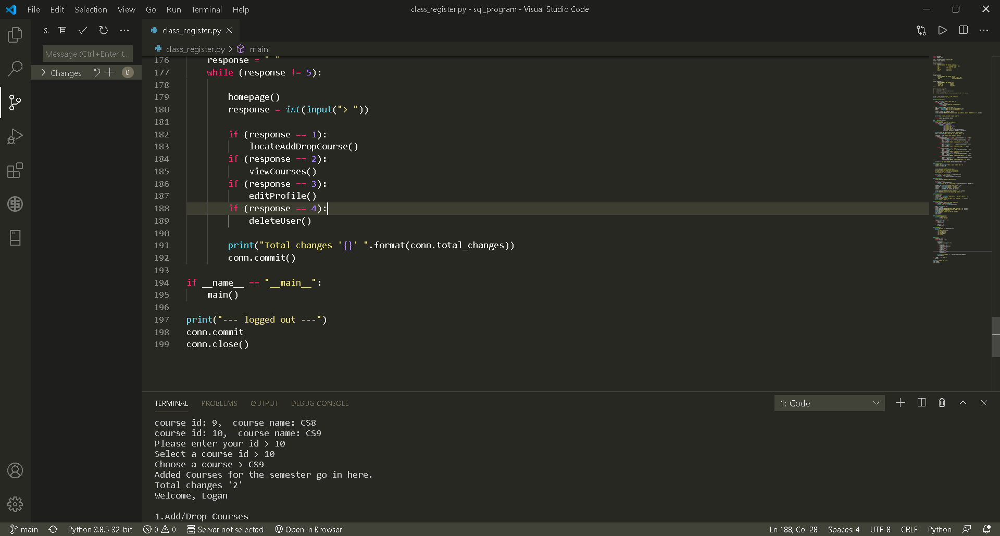

# sql_program

What the program can do
  - insert new data into a table
  - modify exsiting data in a table
  - Delete exsisting data from the table
  - retrieve data

The program can also filter through a collection of names
other ideas maybe added such as matching courses from one row with courses in another row

# COMMANDS USED
sqlite3 commands as well as 
python commands

# PROGRAMMING SOFTWARE USED
Python

# SOURCES
www.w3schools.com
https://byui-cse.github.io/cse310-course/workshops/sqldb_workshop.html
www.stackoverflow.com

# IMAGE OF SOFTWARE TEST

